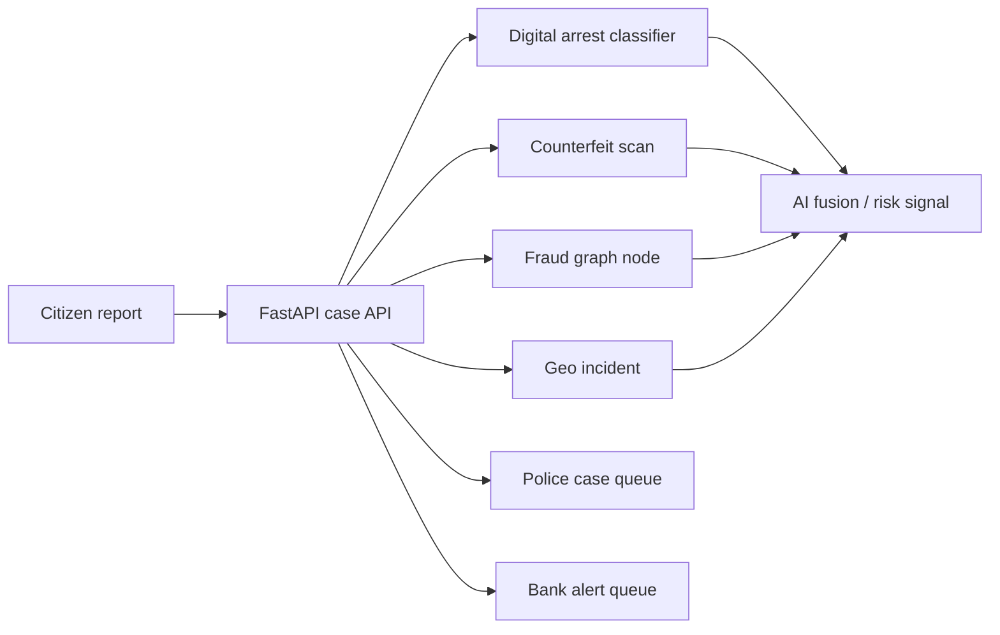

# SentinelAI

> **AI for Digital Public Safety: Defeating Counterfeiting, Fraud & Digital Arrest Scams**

SentinelAI is a hackathon prototype that helps citizens report suspected fraud through AI-assisted workflows, then gives police and banking teams a shared view of the resulting cases. It brings five public-safety intelligence capabilities into one role-based platform.

## Challenge alignment

Digital fraud is increasingly coordinated across calls, payments, devices, locations, and social channels. Digital-arrest scams exploit impersonation and urgency; counterfeit notes are difficult to verify in the field; and disconnected reports make coordinated fraud hard to investigate.

SentinelAI shifts the workflow from a complaint-only process to an intelligence-first process: **report -> analyse -> correlate -> triage -> respond**.

## What we built

### Citizen workspace

Citizens can submit cases through five focused workflows:

1. **Digital Arrest Alert** - classifies suspicious police/agency impersonation calls using scam-script indicators.
2. **Counterfeit Currency** - creates a note-scan case and returns a counterfeit/manual-review signal.
3. **Fraud Network Intelligence** - records risky UPI IDs, accounts, devices, and mule indicators as graph nodes.
4. **Crime Pattern Map** - creates geospatial incidents that can be surfaced as hotspot intelligence.
5. **Citizen Fraud Shield** - assesses suspicious WhatsApp, IVR, and mobile-app messages.

### Police and bank workspaces

- **Police:** shared queue of citizen complaints for triage and investigation.
- **Bank:** payment, account, and counterfeit-related cases filtered from the shared queue.

## Prototype workflow



## Technology

| Layer | Stack |
| --- | --- |
| Frontend | React, Vite, Tailwind CSS, Framer Motion, Lucide |
| Backend | FastAPI, Pydantic |
| Data store | MongoDB / MongoDB Atlas |
| AI prototype | Rule and synthetic-artifact-backed model signals, fusion scoring |
| Visual intelligence | Fraud graph and geospatial incident APIs |

## Project structure

```text
frontend/       Role-based React application
backend/        FastAPI routes, services, MongoDB models
ai_models/      Synthetic datasets, training utilities, model artifacts
docs/           Deployment guidance
```

## Run locally

### 1. Configure MongoDB

The backend needs MongoDB. Use a local MongoDB instance or MongoDB Atlas. Create a root `.env` file:

```env
MONGODB_URL=mongodb://localhost:27017
MONGODB_DB_NAME=sentinelai
```

For Atlas, replace `MONGODB_URL` with the Atlas connection string. Do not commit this file.

### 2. Start the backend

```powershell
python -m pip install -r backend\requirements.txt
python -m uvicorn backend.main:app --host 127.0.0.1 --port 8000
```

Check it is running:

```powershell
Invoke-RestMethod http://127.0.0.1:8000/health
```

### 3. Start the frontend

Open a second terminal:

```powershell
cd frontend
npm install
$env:VITE_API_BASE_URL="http://127.0.0.1:8000"
npm.cmd run dev
```

Open `http://localhost:5173`.

## Hackathon demo script

1. Sign in as a **Citizen** (prototype login is role-based and frontend-only).
2. Submit a **Digital Arrest Alert** containing words such as `digital arrest`, `police`, `OTP`, `KYC`, and `account blocked`.
3. Submit a **Counterfeit Currency** case with a suspicious serial such as `FAKE500A99123`.
4. Submit a **Fraud Network Intelligence** case with a UPI ID/account/device reference.
5. Submit a **Crime Pattern Map** case with location `Mumbai`, `New Delhi`, or `Bengaluru`.
6. Submit a **Citizen Fraud Shield** case describing a suspicious WhatsApp or IVR message.
7. Sign in as **Police** to show the full shared case queue.
8. Sign in as **Bank** to show the bank-relevant subset.

Useful API pages:

- `http://127.0.0.1:8000/docs` — Swagger API explorer
- `GET /api/v1/reports/` — submitted citizen cases
- `GET /api/v1/fraud-graph/networks` — graph nodes
- `GET /api/v1/geo/hotspots` — geospatial incidents
- `GET /api/v1/capabilities/status` — five-capability status

## Prototype scope and responsible claims

This is a hackathon prototype. The current AI services use deterministic scoring and synthetic training artifacts to demonstrate the workflow; they are **not** connected to live telecom, RBI, MHA, WhatsApp, bank, or law-enforcement systems. No production decision should be made from prototype outputs.

The next stage would add consented/authorised data feeds, validated datasets, human review, evidence chains, security audits, model evaluation, and agency integration agreements.

## Future roadmap

- Mobile note-image capture and computer-vision security-feature analysis
- Verified telecom and call-metadata ingestion for real-time digital-arrest alerts
- Transaction/account edge ingestion for fraud-ring clustering
- District-level hotspot prioritisation and response workflows
- Multilingual WhatsApp, IVR, and voice-clone fraud support
- Investigator evidence packets and auditable case timelines

## Security notes

- Keep `.env` and all credentials out of Git.
- Frontend clients never connect directly to MongoDB.
- Use least-privilege Atlas users and restrict network access for deployed systems.
- Treat submitted fraud reports as sensitive information.
